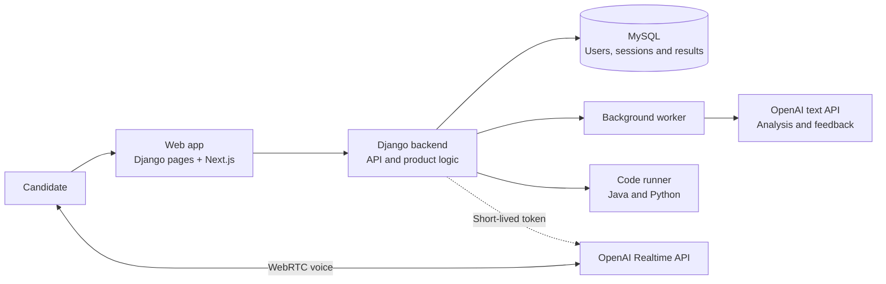
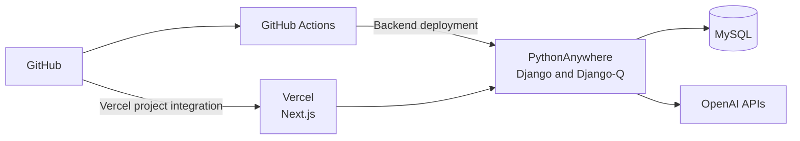

# HackerLeap Architecture

HackerLeap combines three product workflows: AI-assisted resume analysis, realtime
system-design interviews, and deterministic coding practice. Django is the control
plane for identity, authorization, product state, persistence, quotas, and AI job
orchestration. The Next.js application provides the interactive coding workspace.

Django remains the control plane: it owns authentication, quotas, state, and saved
results. Text AI work runs in the background, while realtime voice travels directly
between the candidate's browser and OpenAI using a short-lived credential.

## Key request flows

### Resume analysis

1. Django validates the uploaded PDF and extracts its text with `pypdf`.
2. The user supplies a job description and Django creates a persisted analysis
   record.
3. Django-Q processes the OpenAI request outside the web request lifecycle.
4. System instructions and user-provided data are sent as separate messages.
5. The response must be JSON. Django validates required fields, collection types,
   and score ranges before saving it.
6. The UI polls the persisted queued, processing, completed, or failed state.

The application can also run in manual mode. In that mode it produces the same
prompt without making an API request, providing a low-cost operational fallback.

### Realtime mock interview

1. Django authenticates the candidate, checks quota, and creates an interview
   session.
2. The backend uses its OpenAI credential to mint a short-lived Realtime client
   secret. The permanent API key is never exposed to the browser.
3. The browser connects directly to OpenAI over WebRTC, keeping latency-sensitive
   audio off the Django request path.
4. Candidate and interviewer transcript events are persisted as session turns.
5. After a refresh or reconnect, a bounded portion of the saved transcript is added
   to the new session instructions so the interview can continue naturally.
6. When the interview ends, a text model evaluates the transcript and Django
   validates and stores the structured feedback.

### Coding submissions

1. The Next.js workspace obtains question and track data from authenticated DRF
   endpoints.
2. A run evaluates sample cases; a submission evaluates the configured test suite,
   including hidden cases; a custom run evaluates user-provided input.
3. Django compiles or executes Java and Python code with configured timeouts.
4. Submission and per-test results are persisted and returned to the workspace.

The current executor uses local subprocesses and is intended for a controlled MVP.
A public multi-tenant deployment should move execution into disposable sandboxes
with network, filesystem, CPU, memory, process, and wall-clock restrictions.

## Current deployment

CI runs Django system checks, verifies that migrations are committed, and executes
the backend test suite. Backend deployment conditionally installs dependencies,
runs migrations, and collects static assets based on the files changed.

## Production scaling direction

- Run stateless Django web processes and background workers as separately scaled
  services.
- Replace the ORM-backed job queue with a managed queue that supports retries,
  idempotency, and a dead-letter queue.
- Store uploaded resumes in encrypted object storage instead of local media storage.
- Run untrusted code in disposable, network-isolated containers or microVMs.
- Add per-feature token, latency, audio-minute, queue-depth, and model-cost metrics.
- Preserve the direct browser-to-Realtime media path so application servers do not
  become an audio bottleneck.
